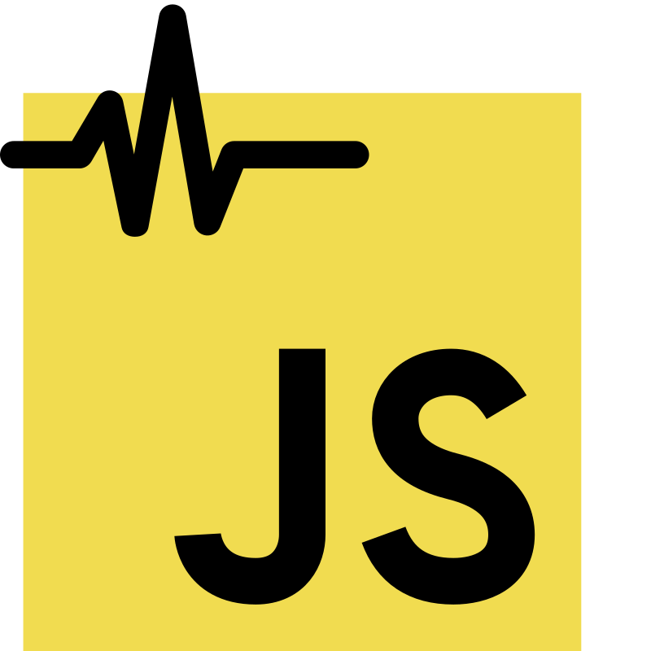

[Back to Main README](../README.md)

# Anura Web Core SDK - CDN sample application



## Setup

1. Install Node.js v23.6.0 or higher.

2. If you want to use `yarn`, make sure it is installed globally.

    ```bash
    npm install --global yarn
    ```

3. Install the server packages:

    ```bash
    cd server
    yarn
    cd ..
    ```

4. Update the environment variables:

    Switch to the `cdn` folder and update the `.env` file with your `STUDY_ID` and
    `LICENSE_KEY`.

5. Run the server:

    ```bash
    yarn start
    ```

6. Open the browser and
    - a. Navigate to `http://localhost:7000` to test the SDK with a webcam
    - b. Navigate to `http://localhost:7000/video.html` to test the SDK with
    a video file

## Load from a Content Delivery Network (CDN)

You can use `Anura Web Core SDK` directly in the browser via a CDN such as
 [unpkg](https://www.unpkg.com/), [jsDelivr](https://www.jsdelivr.com/),
 [Skypack](https://www.skypack.dev/), [esm.sh](https://esm.sh/) and
 [npmmirror](https://npmmirror.com/) (a complete mirror of npmjs.com in China).

 Here are some key advantages of using import maps to load
`Anura Web Core SDK` from well-known CDNs:

### 1. Simplifies Dependency Management

- No need for a bundler like Webpack or Rollup to resolve module imports.
- Works directly in the browser without additional setup.

### 2. Faster Load Times with CDNs

- CDNs optimize delivery with caching, compression, and edge locations.
- Reduces latency compared to self-hosted libraries.

### 3. Automatic Versioning and Updates

- Easily switch versions by updating the import map.
- Can use version pinning (e.g., `unpkg.com/:package@:version/:file`).

### 4. Reduces Build Complexity

- No need for `npm install` or package-lock files for browser-only apps.
- Avoids dependency resolution issues in bundlers.

### 5. Optimized for Browser Environments

- CDNs serve optimized ESM modules with minimal transformations.
- Avoids CommonJS-to-ESM interop issues.

### 6. Flexible Module Resolution

- Define custom mappings to override default module resolutions.
- Allows switching between different CDNs or self-hosted versions without code
changes.

### 7. Ideal for Prototyping and Demos

- Great for quick experiments without setting up a full build pipeline.
- Reduces friction when sharing code samples.

### Using an Import Map

You can use [importmap](https://developer.mozilla.org/en-US/docs/Web/HTML/Element/script/type/importmap)
to reference the SDK:

```html
<!DOCTYPE html>
<html lang="en">
<head>
    <meta charset="UTF-8">
    <meta name="viewport" content="width=device-width, initial-scale=1.0">
    <title>Anura Web Core SDK</title>
    <script type="importmap">
        {
          "imports": {
            "@nuralogix.ai/anura-web-core-sdk": "https://unpkg.com/@nuralogix.ai/anura-web-core-sdk",
            "@nuralogix.ai/anura-web-core-sdk/helpers": "https://unpkg.com/@nuralogix.ai/anura-web-core-sdk/lib/helpers/index.min.mjs",
            "@nuralogix.ai/anura-web-core-sdk/masks/anura": "https://unpkg.com/@nuralogix.ai/anura-web-core-sdk/lib/masks/anura/index.mjs"
          }
        }
    </script>
    <style>
        .measurement-container {width: 360px; height: 640px;}
    </style>
</head>
<body>
    <div class="measurement-container">
        <div id="measurement"></div>
    </div>
    <script type="module">
        import { Measurement, faceAttributeValue, faceTrackerState } from '@nuralogix.ai/anura-web-core-sdk';
        import helpers from "@nuralogix.ai/anura-web-core-sdk/helpers";
        import { AnuraMask } from "@nuralogix.ai/anura-web-core-sdk/masks/vital";

        const { CameraController } = helpers;
        const camera = CameraController.init();

        const mediaElement = document.getElementById('measurement');
        if (mediaElement && mediaElement instanceof HTMLDivElement) {
            const settings = {
                mediaElement,
                assetFolder: 'https://unpkg.com/@nuralogix.ai/anura-web-core-sdk/lib/assets',
                apiUrl: 'api.deepaffex.ai',
                mirrorVideo: true,
                displayMediaStream: true,
                metrics: false
            };
            const measurement = await Measurement.init(settings);
            // Optional Anura Mask Settings
            const anuraMaskSettings = {
                starFillColor: '#39cb3a',
                starBorderColor: '#d1d1d1',
                pulseRateColor: 'red',
                pulseRateLabelColor: '#ffffff',
                backgroundColor: '#ffffff',
                countDownLabelColor: '#000000',
                faceNotCenteredColor: '#fc6a0f',
                /** must be > 0 and <= 1 */
                diameter: 0.44,
                /** must be > 0 and <= 1 */
                sideHeight: 0.06,
                /** Relative to the top of the container */
                maskTopMargin: 10,
                /** Relative to the bottom of the mask */
                heartTopMargin: 30,
                /** Relative to the bottom of the heart */
                starsTopMargin: 20,
            };
            const mask = new AnuraMask(anuraMaskSettings);
        }
    </script>
  </body>
</html>
```

### Using Direct ES Module Import

Alternatively, you can import the module directly from a CDN without using
import maps:

```html
<!DOCTYPE html>
<html lang="en">
<head>
    <meta charset="UTF-8">
    <meta name="viewport" content="width=device-width, initial-scale=1.0">
    <title>Anura Web Core SDK</title>
    <style>
        .measurement-container {width: 360px; height: 640px;}
    </style>
</head>
<body>
    <div class="measurement-container">
        <div id="measurement"></div>
    </div>
    <script type="module">
        import { Measurement, faceAttributeValue, faceTrackerState } from 'https://unpkg.com/@nuralogix.ai/anura-web-core-sdk/lib/index.min.mjs';
        import helpers from "https://unpkg.com/@nuralogix.ai/anura-web-core-sdk/lib/helpers/index.min.mjs";
        import { AnuraMask } from "https://unpkg.com/@nuralogix.ai/anura-web-core-sdk/lib/masks/anura/index.mjs";

        const { CameraController } = helpers;
        const camera = CameraController.init();

        const mediaElement = document.getElementById('measurement');
        if (mediaElement && mediaElement instanceof HTMLDivElement) {
            const settings = {
                mediaElement,
                assetFolder: 'https://unpkg.com/@nuralogix.ai/anura-web-core-sdk/lib/assets',
                apiUrl: 'api.deepaffex.ai',
                mirrorVideo: true,
                displayMediaStream: true,
                metrics: false
            };
            const measurement = await Measurement.init(settings);
            const mask = new AnuraMask();
        }
    </script>
  </body>
</html>
```

## Additional Resources

[Anura Web Core SDK Documentation](https://docs.deepaffex.ai/web-core)
